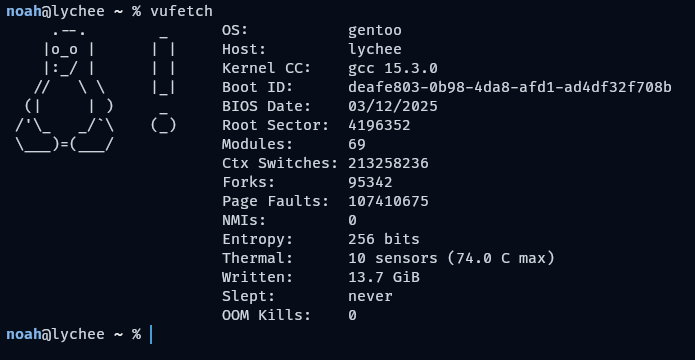

# vufetch - very useful fetch



### if you're on gentoo:
```sh
emerge --ask app-eselect/eselect-repository
eselect repository add noahburchell git https://github.com/noahburchell/noahburchell-overlay.git
emaint sync --repo noahburchell
# may be masked
emerge --ask apps-misc/vufetch

vufetch
```
distro support status:
  - gentoo ✅
  - everything else ❌
  - yes i copied the readme from cube-cli

### if you're on a different distro:

you have to build it

dependencies:
  - linux
  - make
  - gcc 14+ (or clang 19+)

building:
  - run 'make' then 'make install'

licence: GPLv3
